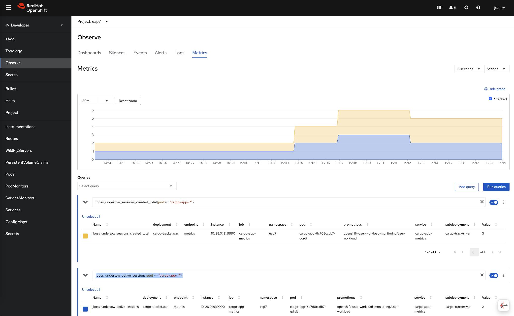
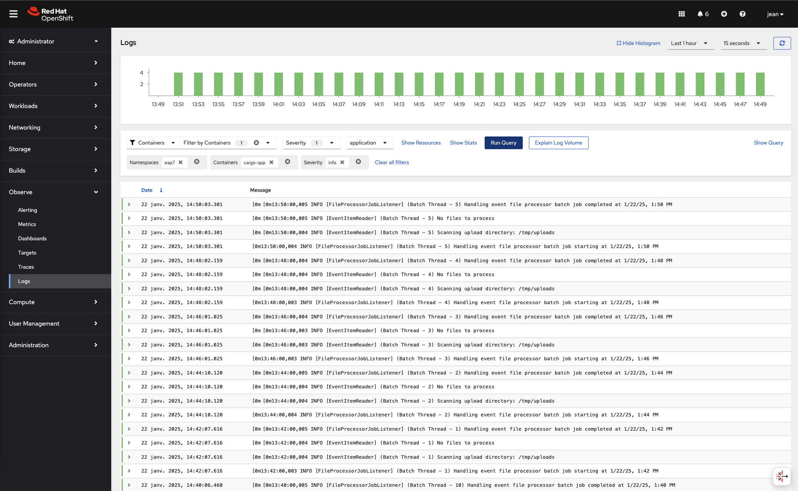
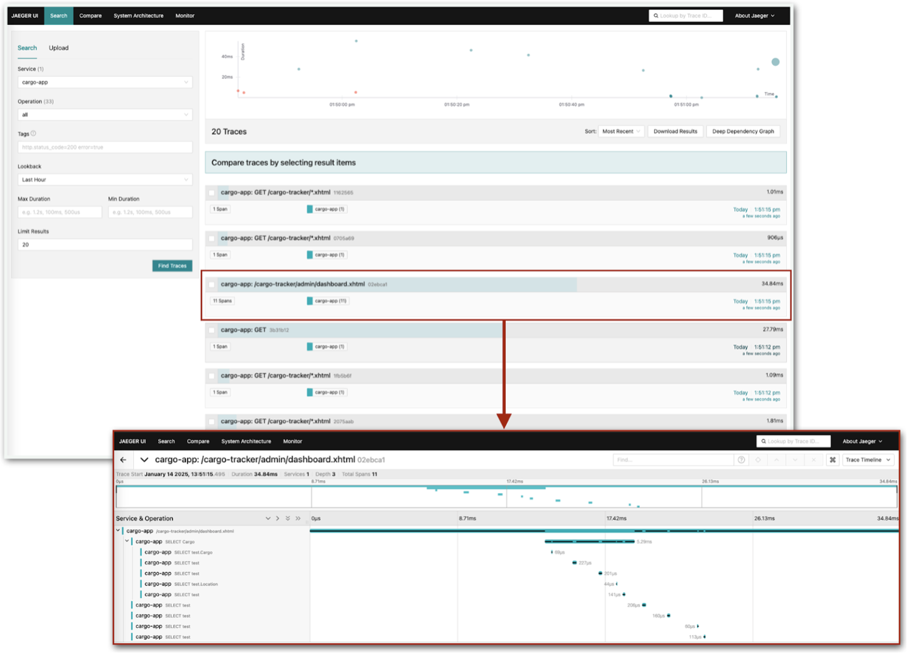
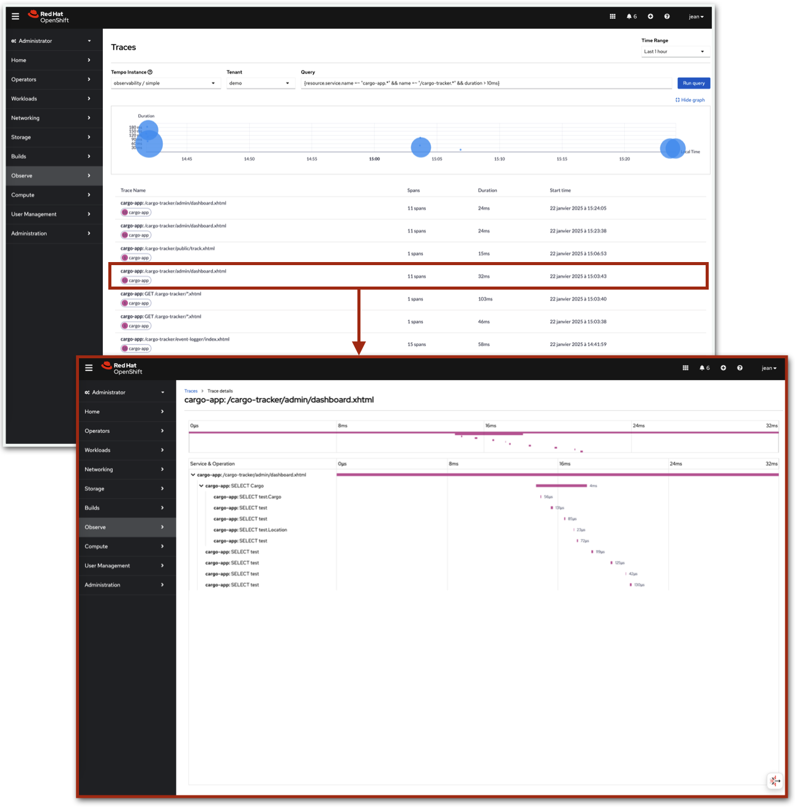

## Monitoring Pods

### Monitoring pods via the Web Console

The Web console offers several ways to help with the monitoring activities

The Developer perspective in general

It is similar to the Administrator perspective,  Project tab; select a project and go to the Workload tab

The Developer perspective and its Observe tab

The Administrator perspective and its Observe menu

Any perspective and the Metrics tab inside a selected Pod 

### Healthchecks

Openshift automatically performs the self-healing of all pods it runs.

[Introduction to Openshift self healing](ocp-healthchecks.md)

The healthchecks, that are part of the deployment object, can rely on 3 mechanisms

*   Commands run inside the container

```yaml
containers:
- name: cargo-app-health
  ...
  readinessProbe:
    exec:
      command:
      - curl
      - '-sw'
      - '%{http_code}'
      - 'localhost:8080'
      - '-o'
      - /dev/null
    timeoutSeconds: 5
    periodSeconds: 10
    successThreshold: 1
    failureThreshold: 3  
```

*   HTTP calls, from inside the container (the port does not have to be exposed on the Openshift SDN network)

```yaml
containers:
- name: cargo-app-health
  ...
  livenessProbe:
    httpGet:
      scheme: HTTP
      path: /
      port: 8080
    timeoutSeconds: 5
    periodSeconds: 10
    successThreshold: 1
    failureThreshold: 3
```

*   TCP calls

```yaml
containers:
- name: cargo-app -health
  ...
  startupProbe:
    tcpSocket:
      port: 8080
    timeoutSeconds: 3
    periodSeconds: 10
    successThreshold: 1
    failureThreshold: 3
    periodSeconds: 10
```

#### Adding healthchecks via the Web Console.

Healthchecks can be added from the  Developer perspective.

In the Topology view, select a pod and go to Actions → Add/Edit Healthchecks

#### Healthchecks with EAP

The EAP server provides an HTTP health endpoint out of the box 

Go to the Terminal of an EAP-based pod and type:

```shell
$ curl localhost:9990/health 
$ curl localhost:9990/health/live 
$ curl localhost:9990/health/ready
```

Therefore, a probe could have been defined as follows:

```yaml
  livenessProbe:
    httpGet:
      scheme: HTTP
      path: /health/live
      port: 9990
```

But the EAP server image also embeds more complete probes in local scripts, which are recommended to use:

For example:

```yaml
containers:
- name: cargo-app-health-cmd
  ...
  readinessProbe:
    exec:
      command:
      - /bin/bash
      - '-c'
      - /opt/eap/bin/readinessProbe.sh
    initialDelaySeconds: 10
    timeoutSeconds: 5
    periodSeconds: 10
    successThreshold: 1
    failureThreshold: 3
  livenessProbe:
    exec:
      command:
      - /bin/bash
      - '-c'
      - /opt/eap/bin/livenessProbe.sh
    initialDelaySeconds: 10
    timeoutSeconds: 5
    periodSeconds: 10
    successThreshold: 1
    failureThreshold: 3  
```

#### Enhancing healthchecks

The healthchecks we saw above are provided by the application runtime thus mainly checks this runtime.  

A developer can decide to add more information to the HTTP healthchecks programmatically, using the “microprofile-health-smallrye” library, which is part of the EAP XP version of the product.

### Capacity management

[Introduction to Openshift Requests and Limits](../ocp/ocp-resources.md)

On the Web Console, in the Metrics tab of one of the Cargo Tracker pod, we can see that the application uses slighlty over 1G of memory.

If you go to the very beginning of the log of those pods, you'll see the Java parameters set by the provided image:

```plaintext
JAVA_OPTS: … -Xms1303m -Xmx1303m …
```

This means that the Pod Memory request should be of 1.5GB, and in our case the memory limit should be approximately the same.  

It's a best practice to disable the ability to schedule pods that don't have defined resources requests and limits in production clusters.

\<add how to config>

The Dashboards available from the Observe tab of the Administrator pespective of the Web Console will allow you to do the capacity management of the cluster.

```plaintext
Select the "Kubernetes / Compute Resources / Cluster" dashboard
```

Eventually you can also assign quotas to some Openshift projects.

Let's see how request and limits affect the applications.

Requests and Limits can be altered in the yaml representation of the Deployment, from the Web Console, both within the Developer and Administrator perspective, in the “Actions” list of the Deployment object, and on the command line.

```shell
oc appy -f resources/monitor/cargo/cargo-deployment-resource.yaml
```

The application has been created with a memory of 512MB and 50 millicores of CPU.  Look at the pod logs and watch that the application takes a long time to start, due to the lack of CPU assigned to it:

```shell
oc get logs
oc logs <pod-name>
```

At the top of the logs, you'll see that the underlying image reacted to the presence of the Request and Limits:

```plaintext
JAVA_OPTS: ... -Xms128m -Xmx512m...
```

Let's give more CPU to the application to help it start:

```shell
oc set resources deployment/cargo-app-resource --limits=cpu=500m --requests=cpu=500m
```

What if the application was too CPU-consuming ?

```shell
oc set resources deployment/cargo-app-resource --limits=cpu=20 --requests=cpu=20
```

Openshift won't schedule the pod on any node and will display “Insufficient cpu”.

### Observability

Red Hat OpenShift Observability provides real-time visibility, monitoring, and analysis of various system metrics, logs, traces, and events to help users quickly diagnose and troubleshoot issues before they impact systems or applications. To help ensure the reliability, performance, and security of your applications and infrastructure, we will cover the following Red Hat OpenShift observability components:
- Monitoring metrics
- Aggregated logging
- Distributed tracing and Red Hat build of OpenTelemetry

#### Monitoring metrics

The EAP server provides a prometheus-compatible metrics endpoint out of the box.

Go to the Terminal of an EAP-based pod and type:

```shell
curl localhost:9990/metrics
```

The Prometheus and Grafana based dashboards shipped with Openshift, or another similar solution, can be used to display those metrics.  

[Introduction to Openshift metrics](../ocp/ocp-metrics.md)

To enable the scraping of metrics by Prometheus, we need to add an object that can provide the scraping configuration specific to the application to the OpenShift user-defined projects Prometheus.  

This object is a `ServiceMonitor`, located in the same namespace as the application.

```yaml
apiVersion: monitoring.coreos.com/v1
kind: ServiceMonitor
metadata:
  labels:
    app: cargo-app-monitor
  name: cargo-app-monitor
spec:
  selector:
    matchLabels:
      app: cargo-app
  endpoints:
  - port: 9990-tcp
    path: /metrics
    interval: 10s
    honorLabels: true
```

As we saw it, the EAP metrics are hidden behind an admin port: 9990.  Contrary to the healthchecks, Prometheus does not scrap information directly within the pod, but remotely uses the Openshift SDN network to access the pod's metrics on its HTTP interface.  Therefore, the admin port 9990 must be exposed at the Service level.

##### Visualize metrics using the OpenShift console

The OpenShift web console provides a metrics panel via the _Administrator or Developer perspective -> Observe -> Metrics_ menu.

For instance, you can query for the `cargo-app` number of active sessions (`jboss_undertow_active_sessions`) and total sessions created (`jboss_undertow_sessions_created_total`) by using the following promQL queries:
- Number of active sessions: `jboss_undertow_active_sessions{pod =~ "cargo-app-.*"}`
- Total sessions created: `jboss_undertow_sessions_created_total{pod =~ "cargo-app-.*"}`

You should be able to observe the metrics with a view similar to the following:



##### Visualize metrics using a Grafana dashboard

> TODO

##### Metrics and the EAP Operator

We saw earlier in the chapter about deploying applications that the EAP Operator already exposed the port 9990.  The intelligence of the Operator is not limited to the deep understanding of the runtime.  It also takes the context the application is in into account.  For example, create another EAP server using the Operator now that the Prometheus User Wokload Monitoring is enabled.  You'll see that the Operator takes that new infomation into account and automatically creates a `ServiceMonitor` object.

### Centralized logging

[Introduction to Openshift Logging](../ocp/ocp-logging.md)
> TODO

You can visualize the aggregated logs in the OpenShift web console via the _Administrator or Developer perspective -> Observe -> Logs_ menu.

For instance, via the _Administrator perspective_, you may query for all the application logs of the cargo-app in the `eap7` namespace by using the `namespaces` and `containers` filters as shown in the screenshot below:



### Distributed tracing and Red Hat build of OpenTelemetry

[Introduction to Distributed Tracing and Red Hat build of OpenTelemetry](../ocp/ocp-opentelemetry.md)

> TODO

#### Traces visualization using the TempoStack Jaeger UI (Red Hat Distributed Tracing Platform)

> *NOTE:* As of OpenShift v4.17 Distributed Tracing Platform, the Jaeger UI is deprecated and will be removed in a future release.

The installed TempoStack instance is enabled for multi-tenancy. For the workshop purposes, there is only one enabled tenant called `demo`. Therefore, the Jaeger UI is exposed at `https://<tempo-simple-gateway-route>/api/traces/v1/demo/search` for the `demo` tenant.



#### Traces visualization using the Cluster Observability Operator distributed tracing UI plugin

As the Jaeger UI is deprecated, it is recommended to use the [Distributed Tracing UI Plugin](https://docs.redhat.com/en/documentation/openshift_container_platform/4.17/html/cluster_observability_operator/observability-ui-plugins#distributed-tracing-ui-plugin) of the [Cluster Observability Operator](https://docs.redhat.com/en/documentation/openshift_container_platform/4.17/html/cluster_observability_operator/index) to visualize the collected application traces. The  Tracing UI is available in the _Administrator perspective_ at _Observe -> Traces_.

For instance, you can filter traces for the cargo-app UI access with a `duration` superior to `10 ms` by using the following traceQL query:
```shell
{resource.service.name =~ "cargo-app.*" && name =~ "/cargo-tracker.*" && duration > 10ms}
```

